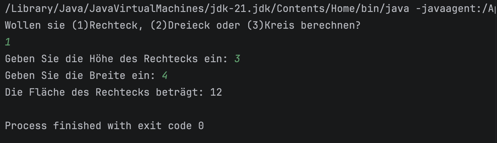
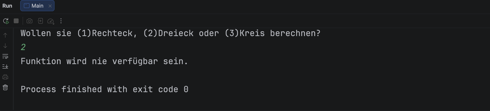

# [App-Name]

> Kurze Beschreibung der Applikation – Was macht sie? Für wen ist sie gedacht?

---

## 📋 Projektinformationen

| Feld              | Inhalt                          |
|-------------------|---------------------------------|
| **Projektname**   | [App-Name]                      |
| **Klasse**        | [z. B. 3AHITM]                  |
| **Schuljahr**     | [z. B. 2025/26]                 |
| **Abgabedatum**   | [TT.MM.JJJJ]                    |
| **Autor/in**      | [Vorname Nachname]              |
| **Lehrer/in**     | [Vorname Nachname]              |
| **Fach**          | [z. B. Informationstechnologie] |

---

## 📝 Projektbeschreibung

Beschreibe hier ausführlich:
- **Ziel der Applikation:** Was soll die App leisten?
- **Hauptfunktionen:** Was kann die App?

---

## 📸 Screenshot

> Füge hier einen Screenshot der laufenden Applikation ein.




<!-- So fügst du einen Screenshot ein:
     1. Screenshot erstellen und als "screenshot.png" im Projektordner speichern
     2. Den Pfad oben anpassen, falls der Screenshot woanders liegt
     Alternativ: mehrere Screenshots für verschiedene Ansichten -->

---

## 🛠️ Entwicklungsumgebung

### Verwendete Software & Tools

| Tool / Software      | Version     | Zweck                          |
|----------------------|-------------|--------------------------------|
| [z. B. VS Code]      | [z. B. 1.89]| Code-Editor                    |
| [z. B. Android Studio| [z. B. 2024]| Emulator / Build               |
| [z. B. Node.js]      | [z. B. 20.x]| Laufzeitumgebung               |
| [z. B. npm]          | [z. B. 10.x]| Paketverwaltung                |
| [z. B. Git]          | [z. B. 2.45]| Versionskontrolle              |

### Frameworks & Bibliotheken

| Paket / Framework    | Version     | Zweck                          |
|----------------------|-------------|--------------------------------|
| [z. B. Ionic]        | [z. B. 7.x] | UI-Framework                   |
| [z. B. Angular]      | [z. B. 17.x]| Frontend-Framework             |
| [z. B. Capacitor]    | [z. B. 5.x] | Native Device APIs             |
| [z. B. Axios]        | [z. B. 1.x] | HTTP-Anfragen                  |

### Betriebssystem (Entwicklung)

- **OS:** [z. B. Windows 11 / macOS 14 / Ubuntu 24.04]

---

## 🚀 Installation & Ausführung

### Voraussetzungen

- [ ] Node.js v[XX] installiert
- [ ] npm / yarn installiert
- [ ] [weitere Voraussetzung]

### Schritte

```bash
# 1. Repository klonen
git clone https://github.com/[username]/[repo-name].git

# 2. In den Projektordner wechseln
cd [repo-name]

# 3. Abhängigkeiten installieren
npm install

# 4. App starten
npm start
# oder
ionic serve
```

> **Hinweis:** [Optionale Hinweise, z. B. API-Key benötigt, `.env`-Datei anlegen, etc.]

---

## 🔗 Quellen

### Links & Dokumentation

| Quelle | URL / Beschreibung |
|--------|--------------------|
| [z. B. Ionic Docs] | https://ionicframework.com/docs |
| [z. B. MDN Web Docs] | https://developer.mozilla.org |
| [z. B. Stack Overflow] | https://stackoverflow.com/questions/[ID] |
| [z. B. YouTube Tutorial] | https://youtu.be/[ID] – „[Titel des Videos]" |

### KI-Unterstützung

| Tool | Verwendeter Prompt / Zweck |
|------|----------------------------|
| [z. B. Claude] | „Erkläre mir, wie ich in Ionic eine HTTP-Anfrage mit Fehlerbehandlung implementiere." |
| [z. B. ChatGPT] | „Erstelle eine TypeScript-Funktion zum Validieren von E-Mail-Adressen." |
| [z. B. GitHub Copilot] | Code-Vervollständigung im Editor |

---

## ⚠️ Bekannte Probleme / Limitierungen

- [ ] [z. B. Funktioniert nur auf Android, nicht auf iOS]
- [ ] [z. B. Keine Offline-Unterstützung]

---

## 📄 Lizenz

Dieses Projekt wurde im Rahmen des Schulunterrichts erstellt und ist nicht für die kommerzielle Nutzung vorgesehen.
